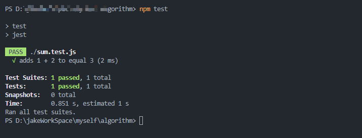

1. 安装依赖

  ```
  npm install --save-dev jest
  npm install babel-jest babel-core@^7.0.0-bridge.0 @babel/core regenerator-runtime babel-preset-env @babel/preset-env
  ```
  编辑package.json

  ```
  {
    "scripts": {
      "test": "jest"
    }
  }
  ```

  编辑.babelrc
  ```
  {
    "presets": ["@babel/preset-env"]
}
  ```

2. 创建js文件

  ```js
  export const sum = (a, b)=> {
    return a + b;
  }
  ```

  ```js
  import {sum} from './sum.js'

  test('adds 1 + 2 to equal 3', () => {
    expect(sum(1, 2)).toBe(3);
  });
  ```

3. 启动测试

  ```
  npm test
  ```
显示如下即为成功


